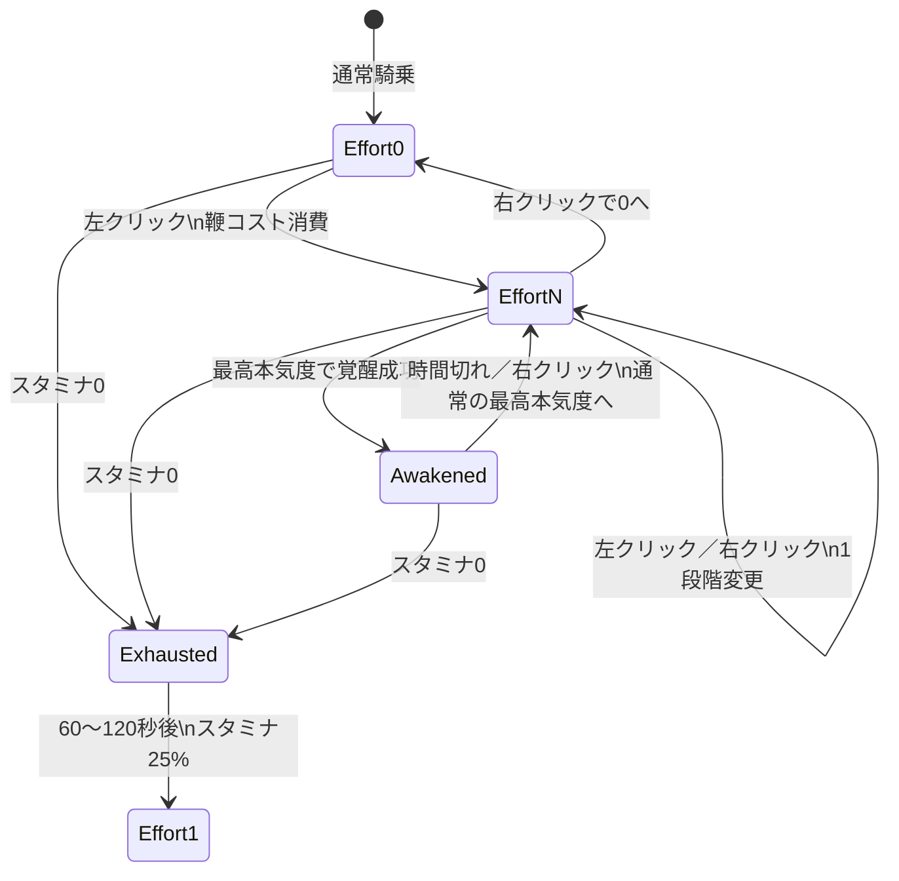

# DerbyJockey2

Paper 1.21.8向けの競走馬・騎乗アクション・馬保存／補填プラグインです。
AI製なのでいろいろおかしいところがあります。人間はプログラム全然できないのでできればあなたが改良してくださいorz
鞭による段階的な加速、馬ごとの最大本気度と最大スタミナ、覚醒、疲労困憊、
ドラフティング、重量付き馬鎧、馬の自動登録、重複しにくいID発行、
能力・外観・所有者・装備を含む保存と運営補填を提供します。
# DerbyJockey Modern

Paper 1.21.8向けの競走馬・騎乗アクション・馬保存／補填プラグインです。

鞭による段階的な加速、馬ごとの最大本気度と最大スタミナ、覚醒、疲労困憊、
ドラフティング、重量付き馬鎧、馬の自動登録、重複しにくいID発行、
能力・外観・所有者・装備を含む保存と運営補填を提供します。

このREADMEは **DerbyJockey Modern 1.4.5-klnefak** の実装を基準にしています。

## 目次

- [動作環境](#動作環境)
- [主な機能](#主な機能)
- [導入方法](#導入方法)
- [プレイヤー向け基本操作](#プレイヤー向け基本操作)
- [騎乗セッション](#騎乗セッション)
- [本気度と移動速度](#本気度と移動速度)
- [最大本気度の生成](#最大本気度の生成)
- [最大スタミナの生成](#最大スタミナの生成)
- [スタミナの走行判定](#スタミナの走行判定)
- [スタミナ消費](#スタミナ消費)
- [スタミナ回復](#スタミナ回復)
- [疲労困憊](#疲労困憊本気度-1)
- [覚醒](#覚醒)
- [ドラフティング](#ドラフティング)
- [重量付き馬鎧](#重量付き馬鎧)
- [馬の自動登録](#馬の自動登録)
- [馬ID](#馬id)
- [運営コマンド](#運営コマンド)
- [権限](#権限)
- [保存データ](#保存される馬データ)
- [監査ログ](#監査ログ)
- [デフォルト設定](#デフォルト設定)
- [設定リファレンス](#設定リファレンス)
- [既知の仕様・制約](#既知の仕様制約)
- [トラブルシューティング](#トラブルシューティング)
- [ビルド](#ビルド)
- [ライセンス](#ライセンス)

## 動作環境

| 項目 | 内容 |
|---|---|
| 対象サーバー | Paper 1.21.8 |
| Minecraft API | 1.21 |
| Java | Java 21 |
| 必須プラグイン | なし |
| 任意プラグイン | なし |
| データ形式 | Bukkit YAML、馬・アイテムのPDC |
| ライセンス | MIT License |

Paper 1.21.8で起動、コマンド登録、停止を確認しています。
Spigot、Purpur、その他のMinecraftバージョンでの動作は保証していません。

## 主な機能

- 左クリックで本気度を上げ、右クリックで下げる専用鞭
- 本気度に応じた馬の移動速度上昇
- 馬ごとに固定保存される最大本気度、最大スタミナ、基礎移動速度
- 馬自身の水平速度を主に使い、取得できない場合は実移動距離で補完する走行判定
- 本気度が高いほど大きくなるスタミナ消費
- 本気度0でのスタミナ回復
- スタミナ切れ時の本気度-1「疲労困憊」
- 能力が低い馬ほど発生しやすい覚醒
- Fキーで対象を選択するドラフティング
- スタミナ消費を増やす1～8段階の重量付き鉄の馬鎧
- 調教、騎乗、名札使用時の馬自動登録
- 重複を検査した自動6桁ID発行
- 名前、外観、所有者、能力、装備、各種フラグの保存
- 通常補填と監査付き強制複製
- 馬の死亡、保存、削除、補填を追跡する監査ログ
- 2020年版DerbyJockeyの鞭と重量付き馬鎧の一部互換

## 導入方法

1. Paper 1.21.8をJava 21で起動できる状態にします。
2. サーバーを完全に停止します。
3. `plugins`から古いDerbyJockeyのJARをすべて外します。
4. `DerbyJockey-Modern-1.4.5-klnefak.jar`を`plugins`へ入れます。
5. 既存データを引き継ぐ場合、`plugins/DerbyJockey`は削除しません。
6. サーバーを起動します。
7. `/plugins`で`DerbyJockey`が1件だけ緑色で表示されることを確認します。
8. `/derbyhorse givewhip <player>`で鞭を配布して動作確認します。

古いJARと新しいJARを同時に入れないでください。どちらもプラグイン名が
`DerbyJockey`のため、重複すると正常にロードできません。

Paperが古いJARを読み続ける場合のみ、サーバー停止中に
`plugins/.paper-remapped`内のDerbyJockeyキャッシュを削除して再起動してください。
このフォルダーはPaperが再生成するキャッシュですが、`plugins/DerbyJockey`は保存データなので
間違えて削除しないでください。

## プレイヤー向け基本操作

### 鞭の入手

鞭は次のどちらかで入手できます。

- 権限を持つ運営が`/derbyhorse givewhip [player]`で配布する
- 棒1個と革1個を、形を問わないクラフトで組み合わせる

標準の鞭は棒をベースにしており、表示名は`Horsewhip`です。
PDCには`derbyjockey:item_type = whip`が保存されます。

### 鞭の使用条件

次の条件をすべて満たす必要があります。

- 馬に騎乗している
- 鞭をメインハンドに持っている
- `derbyjockey.use`権限を持っている
- 直前の鞭操作から設定されたクールダウンが経過している

鞭を持たずに馬へ乗っても騎乗セッションとボスバーは初期化されます。
乗った後に鞭へ持ち替えて使用できます。

### 操作一覧

| 操作 | 動作 |
|---|---|
| 左クリック | 鞭コストを消費して本気度を1上げる |
| 最高本気度で左クリック | 鞭コストを消費して覚醒判定を行う |
| 右クリック | 本気度を1下げる。最低は0 |
| 覚醒中に右クリック | 覚醒を即時解除し、通常の最高本気度へ戻す |
| Fキー | 近くの馬またはトロッコをドラフティング対象にする |

本気度-1は右クリックでは選べません。スタミナ切れ時だけ発生する疲労困憊状態です。

標準のクリッククールダウンは4tickです。20TPSなら約0.2秒です。

## 騎乗セッション

馬へ乗ると、プレイヤーごとに騎乗セッションが作成されます。

通常の新規セッションは次の状態から始まります。

- 本気度: 0
- 現在スタミナ: その馬の最大スタミナ
- 移動速度: 保存済みの基礎移動速度
- ドラフティング対象: なし

ただし、馬に有効な疲労困憊の終了時刻が保存されている場合は、本気度-1・スタミナ0で
疲労を再開します。保存された終了時刻を過ぎていた場合は、本気度1・スタミナ25%で復帰します。

騎乗時にはチャットへ次を表示します。

- 馬ID、または未登録表示
- 最大本気度
- 最大スタミナ
- 未改変版由来のスタミナ補正
- 覚醒確率補正
- 鞭の操作説明

### セッション終了時

次の場合はボスバーを削除し、馬の移動速度を保存済みの基礎移動速度へ戻します。

- 降車
- プレイヤー切断
- 馬の死亡
- プレイヤーが別の乗り物へ移った
- 馬エンティティが無効になった
- プラグイン停止

現在スタミナは、疲労困憊を除いて永続保存していません。
そのため、通常状態で降車して再騎乗するとスタミナは最大値から始まります。
疲労困憊だけは終了時刻を馬のPDCへ保存するため、降車や再起動では解除できません。

## 本気度と移動速度

本気度は次の状態を持ちます。

| 本気度 | 意味 |
|---:|---|
| -1 | スタミナ切れによる疲労困憊 |
| 0 | 通常速度、スタミナ回復状態 |
| 1～最大本気度 | 段階的な加速状態 |
| 最大本気度+1 | 覚醒中だけ使用される特別レベル |



図中の`EffortN`は本気度1～通常の最高本気度、`Awakened`は最高本気度+1、
`Exhausted`は本気度-1を表します。

本気度0以上の移動速度は次の式で設定されます。

```text
実際のMOVEMENT_SPEED基礎値
  = min(1.0, 馬の保存済み基礎移動速度 × (1 + 本気度 × speed-per-level))
```

標準の`speed-per-level`は`0.12`なので、倍率は次のようになります。

| 本気度 | 基礎速度に対する倍率 |
|---:|---:|
| 0 | 1.00倍 |
| 1 | 1.12倍 |
| 2 | 1.24倍 |
| 3 | 1.36倍 |
| 4 | 1.48倍 |
| 5 | 1.60倍 |
| 6 | 1.72倍 |
| 7 | 1.84倍 |

疲労困憊中は次の式になります。

```text
疲労中のMOVEMENT_SPEED基礎値
  = 馬の保存済み基礎移動速度 × slow-speed-multiplier
```

標準値は`0.75`、つまり基礎速度の75%です。

速度の変更対象は馬の`Attribute.MOVEMENT_SPEED`の基礎値です。
騎乗セッション終了時には元の保存済み基礎値へ戻します。

## 最大本気度の生成

最大本気度がまだPDCへ保存されていない馬だけ、新しい値を生成します。

標準範囲は3～6です。単純な一様乱数ではなく、3回の一様乱数の平均を取り、
その値を範囲へ丸めて割り当てます。そのため、最小値・最大値より中央付近が出やすくなります。

```text
roll = (乱数1 + 乱数2 + 乱数3) / 3
最大本気度 = minimum + round(roll × (maximum - minimum))
```

乱数のシードには馬のUUIDを使用します。設定を変えても、すでにPDCへ保存された馬の
最大本気度は自動では再抽選されません。

これはバニラ馬の「複数乱数を組み合わせて中央付近を出やすくする」という考え方を参考にした
独自計算であり、バニラの能力生成式そのものではありません。

## 最大スタミナの生成

最大スタミナは、未改変版DerbyJockeyが使用していたUUID由来の消費補正と、
騎乗時に表示していた想定走行継続時間を、現行版のポイント容量へ換算した値です。

未改変版はスタミナバーを1.0で初期化し、騎乗時に次の時間を表示していました。

```text
未改変版の表示時間 = 1 / (0.005 × 補正値)
```

したがって補正1.00では200秒、補正0.55では約363.64秒が、元版の画面表示上の設計値です。
未改変版の実際の消費処理は`PlayerMoveEvent`の発生回数、本気度、好調状態、
ドラフティング、重量でも変化するため、常に表示どおりの実測時間になるとは限りません。
現行版はイベント回数に依存しない毎tick処理なので、比較基準には元版自身が表示していた時間を使います。

現行版の標準設定では、本気度1の継続消費が毎秒2ポイントです。元版の表示時間を
この消費量で再現するため、基準容量は次のように400ポイントになります。

```text
現行基準容量 = 毎秒2ポイント / 0.005 = 400ポイント
```

概念上の計算は次のとおりです。

```text
補正値 = 1.00 - UUID由来の5桁の数字合計 / 100
最大スタミナ = 400 / 補正値
```

5桁の合計は0～45なので、補正値と最大スタミナの範囲は次のとおりです。

| 項目 | 最小 | 最大 |
|---|---:|---:|
| 未改変版補正 | 0.55 | 1.00 |
| 最大スタミナ | 400.00 | 約727.27 |

### v1.4.4以前との比較

v1.4.4以前は基準容量を100としていたため、補正値の個体差は再現できていましたが、
標準の本気度1消費量と組み合わせた継続時間は元版表示の4分の1でした。

| 補正値 | 未改変版の表示時間 | v1.4.4以前 | v1.4.5 |
|---:|---:|---:|---:|
| 1.00 | 200.00秒 | 50.00秒 | 200.00秒 |
| 0.75 | 266.67秒 | 66.67秒 | 266.67秒 |
| 0.55 | 約363.64秒 | 約90.91秒 | 約363.64秒 |

この表は標準設定`drain-per-second: 0.020`、本気度1、無装備、
ドラフティングなし、鞭の追加使用なしで連続走行した場合です。
設定変更、上位本気度、重量、ドラフティング、鞭コストで実際の時間は変化します。

標準設定の本気度6は毎秒6.50ポイントなので、最大スタミナ400～約727.27では
約61.54～111.89秒です。本気度を上げるほど短くなる現行仕様は維持しています。

実装ではUUIDのhash値を数値化し、9桁未満の場合は馬の最大体力を利用して拡張し、
9桁へパディングした後の末尾5桁を計算に使います。

最大スタミナ、補正モデル番号、互換用endurance、基礎移動速度は馬のPDCへ保存されます。
v1.4.4以前の最大スタミナは、モデル番号が古いか存在しない場合、次に騎乗、保存、
補填のいずれかで馬を読み込んだ時点で400基準へ一度だけ再計算されます。
UUID由来の補正値と馬同士の優劣順位は変わりません。

## スタミナの走行判定

騎乗中の馬自身の`getVelocity()`を毎tick確認し、これを主判定にします。
ただし、Paperが騎乗馬の速度を継続して0として返す環境では消費できないため、
馬自身の1tick間の水平移動距離をフォールバック判定に使用します。
プレイヤーの速度は使用しません。

```text
水平速度の二乗 = velocityX² + velocityZ²
速度検出 = 水平速度の二乗 > velocity-threshold-squared

水平移動距離の二乗 = (現在X - 前tickのX)² + (現在Z - 前tickのZ)²
位置補完検出
  = position-fallback-enabledがtrue
  かつ水平移動距離の二乗 > position-fallback-threshold-squared
  かつ水平移動距離の二乗 <= position-fallback-maximum-distance-squared

走行中 = 速度検出、位置補完検出、または最後の検出から猶予tick以内
```

速度閾値と位置補完閾値の標準値はどちらも`0.000001`、検出猶予は5tickです。
馬速度が0でも実際の水平位置が変わっていれば、位置補完によって走行を検出します。
さらに最後の有効な検出から5tick（20TPSなら0.25秒）は走行状態を維持し、
消費処理が細かく途切れないようにしています。

位置補完の標準上限は距離二乗`4.0`、つまり1tickで2ブロックです。
これを超える位置変化はテレポート相当として補完判定から除外します。

v1.4.2以前の標準値`0.0004`が既存設定に残っている場合は、v1.4.3の初回起動時に
`0.000001`へ自動移行します。標準値以外へ手動変更されている設定は上書きしません。

走行判定の情報は、馬へ乗った状態で`/derbyhorse debug`を実行すると確認できます。
診断の`検出元`には`馬速度`、`実移動補完`、`検出猶予`、`なし`のいずれかが表示されます。

### この判定に含まれる動き

- 前進
- 後退
- 横滑り
- ノックバック
- 水流などによる水平移動

### この判定に含まれない動き

- 水平方向へ動かない落下
- 水平方向へ動かないジャンプ
- 停止中に保持されているバニラのMOVEMENT_SPEED属性値

同一ワールド内で1tickあたり2ブロック以下の短距離テレポートは、実移動補完として
最大5tickだけ走行扱いになる可能性があります。2ブロックを超える位置変化と
ワールドをまたぐテレポートは、位置補完では走行扱いになりません。

## スタミナ消費

本気度1以上で馬が走行中のときだけ、継続スタミナを消費します。

本気度0では走っていても継続消費しません。本気度1以上で停止しているときは、
消費も回復もしません。疲労困憊中も通常の消費・回復は行いません。

1秒あたりの継続消費量は次の式です。

```text
継続消費ポイント/秒
  = drain-per-second × 100
  × 本気度倍率
  × 重量倍率
  × ドラフティング倍率

本気度倍率
  = 1 + (本気度 - 1) × additional-level-drain-multiplier

重量倍率
  = 1 + 重量レベル × 0.10

ドラフティング倍率
  = 対象有効時 0.70、それ以外 1.00
```

標準設定では基礎消費が毎秒2ポイント、本気度追加倍率が0.45です。

| 本気度 | 本気度倍率 | 無装備・対象なしの毎秒消費 |
|---:|---:|---:|
| 1 | 1.00倍 | 2.00 |
| 2 | 1.45倍 | 2.90 |
| 3 | 1.90倍 | 3.80 |
| 4 | 2.35倍 | 4.70 |
| 5 | 2.80倍 | 5.60 |
| 6 | 3.25倍 | 6.50 |
| 7 | 3.70倍 | 7.40 |

覚醒中の「最大本気度+1」も同じ式で計算するため、通常の最高本気度より消費が大きくなります。

### 鞭そのものの消費

左クリックで鞭を入れるたび、走行状態に関係なく`whip-cost × 100`ポイントを消費します。
標準値`0.035`では3.5ポイントです。

右クリックはスタミナを消費しません。

覚醒中にさらに左クリックした場合も3.5ポイントを消費しますが、本気度はそれ以上上がらず、
追加の覚醒判定も行いません。

## スタミナ回復

本気度0のときだけ、移動中・停止中を問わず一定間隔で回復します。

```text
1回の回復量
  = 最大スタミナ × recovery-percent-per-interval
```

標準設定は5tickごとに最大スタミナの1%です。20TPSなら0.25秒ごと、毎秒約4%です。
最大値を超えた分は切り捨てられます。

本気度1以上で停止していても回復しません。回復したい場合は右クリックで本気度0へ戻します。

## 疲労困憊（本気度-1）

継続消費または鞭コストによってスタミナが0になると、即座に疲労困憊へ入ります。

### 疲労開始時

- 覚醒を解除
- 本気度を-1へ変更
- スタミナを0で固定
- 移動速度を標準で基礎速度の75%へ低下
- 60～120秒から、両端を含めて疲労時間をランダム抽選
- 画面中央へ疲労時間を表示
- ボスバーを赤色にし、残り秒数を表示
- 終了予定のUNIX時刻（ミリ秒）を馬のPDCへ保存

疲労中は左クリックで加速できません。操作すると残り時間をアクションバーへ表示します。
右クリックでも本気度は変化しません。

### 疲労終了時

- PDCの疲労終了時刻を削除
- 本気度を1へ変更
- スタミナを最大値の25%まで回復
- 本気度1の速度倍率を適用
- 復帰内容をアクションバーへ表示

疲労時間はサーバーtickではなく実時刻で管理します。そのため、降車、再騎乗、
チャンクのアンロード、サーバー再起動を挟んでも予定時刻までは疲労が維持されます。

疲労中に降車すると、騎乗していない間の馬速度は基礎値へ戻ります。
疲労期限前に再騎乗すると再び本気度-1の速度が適用されます。
期限後に初めて再騎乗した場合は本気度1・スタミナ25%で開始します。

通常の馬記録から`restore`／`forcesummon`で補填した馬へ、元エンティティの進行中の疲労は
引き継がれません。疲労終了時刻は馬エンティティのPDCにのみ保存され、
`horse-records.yml`の補填用記録には含まれないためです。

## 覚醒

覚醒は通常の最高本気度を超える一時的な加速状態です。

### 覚醒判定が行われる条件

次のいずれかで判定します。

- 通常の最高本気度で走行中、1秒ごと
- 通常の最高本気度で、さらに左クリックして鞭を入れたとき

次の場合は判定しません。

- 覚醒機能が無効
- すでに覚醒中
- 疲労困憊中
- 本気度が通常の最高本気度未満
- 走行中の毎秒判定については馬が停止中

標準の基礎確率は、走行中の毎秒判定が1%、鞭ごとの判定が2%です。

### 能力による確率補正

最大本気度と最大スタミナをそれぞれ0～1へ正規化し、その平均を馬の総合品質として使います。

```text
本気度品質 = normalize(最大本気度, 設定最小値, 設定最大値)
スタミナ品質 = normalize(最大スタミナ, 400, 727.27)
総合品質 = (本気度品質 + スタミナ品質) / 2

覚醒倍率
  = 低能力倍率 + (高能力倍率 - 低能力倍率) × 総合品質

最終確率 = clamp(基礎確率 × 覚醒倍率, 0, 1)
```

標準値では、最低能力の馬が1.75倍、最高能力の馬が0.35倍です。

| 馬の能力 | 毎秒判定 | 鞭ごとの判定 |
|---|---:|---:|
| 最低能力 | 1.75% | 3.50% |
| 中間能力の目安 | 約1.05% | 約2.10% |
| 最高能力 | 0.35% | 0.70% |

設定で低能力倍率と高能力倍率を逆に記述しても、実装側で大きい値を低能力側、
小さい値を高能力側へ割り当て、低能力ほど覚醒しやすい仕様を維持します。

### 覚醒成功時

- 本気度を「通常の最大本気度+1」へ変更
- スタミナを最大値まで全回復
- 20～50秒から、両端を含めて継続時間をランダム抽選
- 覚醒レベルの速度倍率を適用
- トーテム使用音を再生
- 画面中央へ覚醒レベル、時間、全回復を表示
- ボスバーを桃色にし、残り秒数を表示

覚醒時間は20tickを1秒とするサーバーtick基準です。サーバーが20TPSを下回る場合、
現実時間では設定秒数より長く感じることがあります。

時間切れになると通常の最高本気度へ戻ります。覚醒中に右クリックすると即時解除できます。
覚醒中にスタミナが0になった場合は覚醒を解除し、そのまま疲労困憊へ移行します。

## ドラフティング

馬へ騎乗中にFキーを押すと、馬の周囲`X/Z ±6、Y ±3`以内にある
最も近い馬またはトロッコを対象にします。

対象は次の条件を満たす間だけ有効です。

- 選択から100tick以内。20TPSなら5秒
- 対象が有効なVehicleエンティティ
- 同じワールド
- 自分の馬から10ブロック以内

有効中は継続スタミナ消費が70%、つまり30%軽減されます。
鞭そのものの3.5ポイント消費は軽減されません。

有効な対象がある間、通常時のボスバーは黄色になります。
対象が見つからない場合はアクションバーへその旨を表示し、対象を解除します。

Fキーの入れ替え操作は、騎乗セッションが存在する場合にキャンセルされます。
現在の実装ではドラフティング操作自体に個別の権限チェックはありません。

## 重量付き馬鎧

鉄の馬鎧1個と鉄インゴット1～8個を、形を問わないクラフトで組み合わせると、
重量レベル1～8の鉄の馬鎧を作成できます。

| 鉄インゴット数 | 重量 | 継続消費倍率 |
|---:|---:|---:|
| 1 | 1 | 1.10倍 |
| 2 | 2 | 1.20倍 |
| 3 | 3 | 1.30倍 |
| 4 | 4 | 1.40倍 |
| 5 | 5 | 1.50倍 |
| 6 | 6 | 1.60倍 |
| 7 | 7 | 1.70倍 |
| 8 | 8 | 1.80倍 |

重量は`derbyjockey:armor_weight`としてアイテムPDCへ保存されます。
重量付き馬鎧は継続消費だけを増やし、鞭コスト、最大スタミナ、移動速度には直接影響しません。

重量値は読み込み時に0～8へ制限されます。鉄の馬鎧以外は重量装備として認識されません。

## 旧版アイテム互換

### 旧版の鞭

棒であり、色を除いたLoreのいずれかの行が完全に`DerbyJockey Item`である場合、
現行PDCがなくても鞭として認識します。

この互換判定は表示名を確認しません。そのため、条件を満たすLoreを持つ棒も鞭として扱われます。

### 旧版の重量付き馬鎧

鉄の馬鎧で、色を除いたLoreに`impost:+N`形式の行がある場合、Nを重量として読み込みます。
Nは0～8へ制限されます。

## ボスバー表示

騎乗中は次の情報を1本のボスバーへ表示します。

- 馬のカスタム名。未設定なら`Horse`
- 馬ID。未登録なら`未登録`
- 現在本気度／最大本気度
- 現在スタミナ／最大スタミナ
- スタミナ率
- 本気度に対応する消費倍率
- 走行中に現在適用している毎秒消費量
- 本気度1以上で馬速度・実移動の両方を検出できていない場合の`移動未検出`表示
- 覚醒中の残り秒数
- 疲労困憊中の残り秒数

色の優先順位と意味は次のとおりです。

| 色 | 状態 |
|---|---|
| 桃 | 覚醒中 |
| 赤 | 疲労困憊中 |
| 黄 | ドラフティング対象が有効 |
| 緑 | 通常 |

ボスバーの進捗は現在スタミナ率です。

## 馬の自動登録

標準設定では次のタイミングで登録・更新します。

| タイミング | 動作 |
|---|---|
| 馬の調教成功 | 未登録なら自動IDを発行して保存 |
| 調教済み馬への騎乗 | 未登録なら登録、登録済みなら記録更新 |
| 名札を馬へ使用 | 登録または更新。使用者へIDを通知 |
| 登録済み馬から降車 | 現在の状態で記録更新 |
| サーバー停止 | 全ワールドのロード済み登録馬を更新 |

調教と名札のイベントでは、バニラ側の変更が完了した次のサーバーtickに保存します。

死亡時は記録を自動削除しません。`horse-audit.log`へ`DEATH`を記録し、
運営が記録から補填するか削除するかを判断できます。

## 馬ID

### 自動ID

標準では100000～999999の範囲から`SecureRandom`で数字IDを生成します。

生成時に次を確認します。

- `horse-records.yml`に同じIDが存在しない
- 現在ロード済みの全ワールドの馬が同じIDを持っていない

最大10,000回抽選し、空きIDを確保できなければエラーにします。

### 手動ID

手動IDは小文字へ正規化され、次の形式だけ許可します。

```regex
[a-z0-9_-]{1,32}
```

使用できるのは英小文字、数字、アンダースコア、ハイフンで、1～32文字です。

次の場合は保存を拒否します。

- 別の保存記録が同じIDを使用中
- 別のロード済み馬が同じIDを使用中
- 選択した馬が、別の有効な保存IDをすでに持っている

IDは馬のPDC`derbyjockey:horse_record_id`へも保存されます。

## 運営コマンド

基本コマンドは`/derbyhorse`です。エイリアスとして`/dh`と`/derbyjockey`を使用できます。

`/derbyhorse help`以外のサブコマンドには`derbyjockey.admin`が必要です。

| コマンド | 説明 | コンソール |
|---|---|---|
| `/derbyhorse help` | ヘルプ表示 | 可 |
| `/derbyhorse givewhip [player]` | 鞭を配布 | player指定時のみ可 |
| `/derbyhorse save [id]` | 騎乗中または照準先の馬を保存 | 不可 |
| `/derbyhorse id` | 選択中の馬のID・能力を表示 | 不可 |
| `/derbyhorse info` | 選択中の馬のID・能力を表示 | 不可 |
| `/derbyhorse info <id>` | 保存記録の詳細を表示 | 可 |
| `/derbyhorse list` | 保存済みIDをソートして一覧表示 | 可 |
| `/derbyhorse restore <id> [player]` | 通常補填 | player指定時のみ可 |
| `/derbyhorse forcesummon <id> [player]` | 重複検査を無視して強制複製 | player指定時のみ可 |
| `/derbyhorse delete <id>` | 保存記録を削除 | 可 |
| `/derbyhorse debug` | 騎乗中の速度判定・倍率・毎秒消費量を診断 | 不可 |

`save`、引数なしの`id`／`info`は、プレイヤーが馬へ乗っている場合はその馬を選択します。
乗っていない場合は、標準8ブロック以内で照準を合わせている馬を選択します。

オンラインプレイヤー名と保存IDはTab補完に対応しています。

### `/derbyhorse debug`

馬へ乗った状態で実行すると、次の診断情報を表示します。

- 現在本気度と消費倍率
- 馬の水平速度二乗と設定閾値
- 馬の1tick水平移動距離二乗と位置補完閾値
- 走行判定が有効か、移動未検出か
- 検出元が馬速度、実移動補完、検出猶予、なしのどれか
- 検出猶予tickとテレポート除外上限
- 重量付き馬鎧の重量
- ドラフティング状態
- 条件上の走行時消費ポイント／秒
- 現在実際に適用している消費ポイント／秒
- 基礎消費設定と本気度追加倍率設定

本気度6の標準倍率は3.25倍、無装備・ドラフティングなしでは6.50ポイント／秒です。
診断の`消費倍率`が3.25でも`現在適用`が0の場合は、倍率ではなく走行判定が無効です。

### `/derbyhorse givewhip [player]`

指定プレイヤーのインベントリへ現行PDC付き鞭を追加します。
インベントリへ入りきらなかった分は、そのプレイヤーの足元へドロップします。

### `/derbyhorse save [id]`

IDを省略すると、既存IDを更新するか新しい自動IDを発行します。
IDを指定すると、形式・保存記録・ロード済み馬との重複を検査して保存します。

### `/derbyhorse info [id]`と`id`

現物の馬については次を表示します。

- エンティティUUID
- 保存ID
- 毛色と模様
- 保存済み基礎移動速度
- 跳躍力
- 最大本気度
- 最大スタミナ
- 未改変版スタミナ補正
- 覚醒確率補正

保存IDを指定した場合は、保存記録から名前、外観、体力、速度、跳躍力、Derby能力、
覚醒補正、保存者、保存日時を表示します。

### `/derbyhorse restore <id> [player]`

保存記録を対象プレイヤーの現在位置へ復元します。

同じ記録IDを持つ馬が現在ロード済みの場合は拒否し、その馬のワールドと座標を表示します。
エンティティ生成後の記録適用に失敗した場合は、生成した馬を削除してエラーにします。

重複検査で確認できるのはロード済みエンティティだけです。未読み込みチャンク内に同じIDの馬が
存在していても検出できません。通常補填は運営が死亡・喪失を確認してから実行してください。

### `/derbyhorse forcesummon <id> [player]`

ロード済みの同一ID馬が存在しても強制的に複製します。
`derbyjockey.admin`に加え、`derbyjockey.admin.force`が必要です。

複製された馬の一時IDは次の形式です。

```text
元ID-copy-新しい馬UUIDの先頭8文字
```

この一時IDは保存記録を新規作成しません。複製馬を後から調教・騎乗・保存した場合、
`-copy-`を含むIDは正式IDとして再利用せず、新しい重複しない数字IDを発行します。

強制複製は`horse-audit.log`へ記録します。

### `/derbyhorse delete <id>`

`horse-records.yml`から記録を削除し、現在ロード済みで同じIDを持つ全馬から
`horse_record_id`のPDCを削除します。未読み込みチャンク内の馬のPDCまでは変更できません。

削除した記録を戻すコマンドはありません。実行前にバックアップしてください。

## 権限

| 権限 | 既定 | 内容 |
|---|---|---|
| `derbyjockey.use` | 全員 | 騎乗中の鞭使用 |
| `derbyjockey.admin` | OP | 鞭配布、保存、閲覧、一覧、通常補填、削除 |
| `derbyjockey.admin.force` | OP | `forcesummon`による強制複製 |

`derbyjockey.admin.force`だけを付与しても、先に行われる共通管理者判定を通れないため、
強制複製には両方の管理権限が必要です。

## 保存される馬データ

補填用記録は`plugins/DerbyJockey/horse-records.yml`へ保存します。
現在の記録スキーマ番号は3です。

| 分類 | 保存内容 |
|---|---|
| メタデータ | スキーマ、保存日時、保存者、保存元UUID |
| 名前 | カスタム名、名前表示状態 |
| 外観 | 毛色、模様 |
| 年齢 | 成馬判定、年齢tick、年齢固定 |
| 調教 | 調教済み、懐き度、最大懐き度、所有者UUID |
| 体力 | 最大体力の基礎値、保存時の現在体力 |
| 移動 | 保存済み基礎移動速度、跳躍力 |
| Derby能力 | 最大本気度、最大スタミナ、スタミナモデル、補正、互換endurance |
| 装備 | 鞍、馬鎧のItemStack |
| フラグ | AI、無敵、消音、発光、重力、永続化 |

保存時の現在体力は最低1.0として記録します。復元時は1.0～最大体力へ制限します。
跳躍力は復元時に0.0～2.0へ制限します。

`writeRecord`は対象IDの古いセクションをいったん消してから現在値を書き直すため、
手動で独自キーを同じ馬セクションへ追加しても次回更新時に失われます。

### 馬エンティティへ保存するPDC

| キー | 型 | 内容 |
|---|---|---|
| `derbyjockey:max_speed_level` | INTEGER | 最大本気度 |
| `derbyjockey:max_stamina` | DOUBLE | 最大スタミナ |
| `derbyjockey:stamina_model` | INTEGER | スタミナモデル番号 |
| `derbyjockey:endurance` | DOUBLE | 旧版互換用の最大スタミナ÷400 |
| `derbyjockey:base_movement_speed` | DOUBLE | Derby補正前の基礎移動速度 |
| `derbyjockey:horse_record_id` | STRING | 保存記録ID |
| `derbyjockey:exhaustion_until_epoch_millis` | LONG | 疲労終了予定のUNIX時刻 |

## 監査ログ

監査ログは`plugins/DerbyJockey/horse-audit.log`へUTF-8で追記します。

1行の形式は次のとおりです。

```text
ISO-8601時刻<TAB>操作<TAB>ID<TAB>実行者<TAB>ワールド,X,Y,Z
```

位置が存在しない操作は最後の列が`-`になります。

記録される操作は次のとおりです。

| 操作 | ログ名 |
|---|---|
| 新規または明示的な保存 | `SAVE` |
| 通常補填 | `RESTORE` |
| 強制複製 | `FORCE-RESTORE` |
| 記録削除 | `DELETE` |
| 登録馬の死亡 | `DEATH` |

登録済み馬の降車時更新、名札による既存記録更新、停止時更新など、
既存IDへの自動上書きは監査ログへ毎回記録しません。

## デフォルト設定

```yaml
whip:
  recipe-enabled: true
  speed-per-level: 0.12
  slow-speed-multiplier: 0.75
  click-cooldown-ticks: 4

stamina:
  drain-per-second: 0.020
  additional-level-drain-multiplier: 0.45
  recovery-interval-ticks: 5
  recovery-percent-per-interval: 0.01
  exhaustion-minimum-duration-seconds: 60
  exhaustion-maximum-duration-seconds: 120
  resume-threshold: 0.25
  whip-cost: 0.035
  velocity-threshold-squared: 0.000001
  velocity-detection-grace-ticks: 5
  position-fallback-enabled: true
  position-fallback-threshold-squared: 0.000001
  position-fallback-maximum-distance-squared: 4.0

awakening:
  enabled: true
  chance-per-second-at-max: 0.01
  chance-per-whip-at-max: 0.02
  minimum-duration-seconds: 20
  maximum-duration-seconds: 50
  low-stat-multiplier: 1.75
  high-stat-multiplier: 0.35

horse-id:
  minimum: 100000
  maximum: 999999

generated-stats:
  minimum-speed-level: 3
  maximum-speed-level: 6

commands:
  horse-selection-distance: 8

storage:
  auto-register-on-tame: true
  auto-register-tamed-horse-on-mount: true
  auto-update-on-name-tag: true
  auto-update-registered-horse-on-dismount: true
  auto-update-registered-horses-on-shutdown: true
```

起動時に不足しているデフォルトキーを既存`config.yml`へ追加して保存します。
既存の設定値は原則として上書きしません。ただし、旧版の標準値がそのまま残っている
次の2項目だけは自動移行します。

| キー | 旧標準値 | 新標準値 | 理由 |
|---|---:|---:|---|
| `stamina.velocity-threshold-squared` | `0.0004` | `0.000001` | 騎乗馬の走行を検出しやすくする |
| `stamina.drain-per-second` | `0.012` | `0.020` | v1.4.5の400基準容量と元版表示時間を一致させる |

これらと完全に一致しない手動設定値は維持します。旧バージョンで使用していた不要なキーは
自動削除しません。意図的に`0.012`を使いたい場合は、初回移行後にもう一度設定してください。

## 設定リファレンス

### `whip`

| キー | 既定値 | 説明 |
|---|---:|---|
| `recipe-enabled` | `true` | 鞭と重量付き馬鎧のレシピを登録 |
| `speed-per-level` | `0.12` | 本気度1ごとの速度倍率加算 |
| `slow-speed-multiplier` | `0.75` | 本気度-1の速度倍率 |
| `click-cooldown-ticks` | `4` | 鞭操作の最短間隔。最低1tickへ補正 |

### `stamina`

| キー | 既定値 | 説明 |
|---|---:|---|
| `drain-per-second` | `0.020` | 100を1.0とした毎秒基礎消費。0.020は2ポイント |
| `additional-level-drain-multiplier` | `0.45` | 本気度が1上がるごとの消費倍率加算 |
| `recovery-interval-ticks` | `5` | 本気度0の回復間隔。最低1tick |
| `recovery-percent-per-interval` | `0.01` | 1回あたり最大スタミナ回復率 |
| `exhaustion-minimum-duration-seconds` | `60` | 疲労時間の抽選下限。最低1秒 |
| `exhaustion-maximum-duration-seconds` | `120` | 疲労時間の抽選上限。下限未満なら下限を使用 |
| `resume-threshold` | `0.25` | 疲労終了時のスタミナ率。0～1へ制限 |
| `whip-cost` | `0.035` | 左クリック1回の消費。0.035は3.5ポイント |
| `velocity-threshold-squared` | `0.000001` | 水平速度二乗の走行検出閾値。最低0 |
| `velocity-detection-grace-ticks` | `5` | 最後の速度検出後も走行扱いを維持するtick数。最低0 |
| `position-fallback-enabled` | `true` | 馬速度が取れない場合の実移動距離による補完を有効化 |
| `position-fallback-threshold-squared` | `0.000001` | 1tick水平移動距離二乗の補完検出閾値。最低0 |
| `position-fallback-maximum-distance-squared` | `4.0` | この値を超える位置変化をテレポート相当として除外。補完閾値未満なら補完閾値を使用 |

### `awakening`

| キー | 既定値 | 説明 |
|---|---:|---|
| `enabled` | `true` | 覚醒機能の有効化 |
| `chance-per-second-at-max` | `0.01` | 最高本気度で走行中の毎秒基礎確率 |
| `chance-per-whip-at-max` | `0.02` | 最高本気度で鞭を入れた際の基礎確率 |
| `minimum-duration-seconds` | `20` | 覚醒時間の抽選下限。最低1秒 |
| `maximum-duration-seconds` | `50` | 覚醒時間の抽選上限。下限未満なら下限を使用 |
| `low-stat-multiplier` | `1.75` | 低能力側の覚醒確率倍率候補 |
| `high-stat-multiplier` | `0.35` | 高能力側の覚醒確率倍率候補 |

確率は能力補正後に0～1へ制限します。負の基礎確率は実質0になります。

### `horse-id`

| キー | 既定値 | 説明 |
|---|---:|---|
| `minimum` | `100000` | 自動数字IDの下限。最低0 |
| `maximum` | `999999` | 自動数字IDの上限。下限未満なら下限を使用 |

### `generated-stats`

| キー | 既定値 | 説明 |
|---|---:|---|
| `minimum-speed-level` | `3` | 新規生成する最大本気度の下限。最低1 |
| `maximum-speed-level` | `6` | 新規生成する最大本気度の上限。下限未満なら下限を使用 |

### `commands`

| キー | 既定値 | 説明 |
|---|---:|---|
| `horse-selection-distance` | `8` | 照準でコマンド対象馬を選択できる距離。最低1ブロック |

### `storage`

| キー | 既定値 | 説明 |
|---|---:|---|
| `auto-register-on-tame` | `true` | 調教成功時に自動登録 |
| `auto-register-tamed-horse-on-mount` | `true` | 調教済み馬への騎乗時に登録・更新 |
| `auto-update-on-name-tag` | `true` | 名札使用後に登録・更新 |
| `auto-update-registered-horse-on-dismount` | `true` | 降車時に登録済み馬を更新 |
| `auto-update-registered-horses-on-shutdown` | `true` | 停止時にロード済み登録馬を更新 |

## バックアップ

更新、設定変更、補填、記録削除の前に、サーバーを停止して次をバックアップしてください。

- ワールドフォルダー
- `plugins/DerbyJockey/config.yml`
- `plugins/DerbyJockey/horse-records.yml`
- `plugins/DerbyJockey/horse-audit.log`

馬のPDCはワールド内のエンティティデータへ保存されます。
`horse-records.yml`だけでは、ワールド内に存在する馬エンティティそのものや進行中の疲労を
完全にはバックアップできません。

## パフォーマンス特性

- 毎tickの処理対象は、現在このプラグインの騎乗セッションに入っている馬だけです。
- 各セッションで水平速度、スタミナ、状態時間、ボスバーを更新します。
- 有効なドラフティング対象がある場合は、対象エンティティと距離を確認します。
- ID重複検査と補填時の検索は、全ワールドのロード済み馬を走査します。
- 停止時自動更新が有効な場合、停止処理で全ワールドのロード済み馬を走査します。
- `horse-records.yml`の保存は同期I/Oです。非常に大きな記録ファイルで頻繁に更新すると、
  短いメインスレッド停止が発生する可能性があります。

通常規模では騎乗人数に比例する軽量な処理ですが、大規模サーバーでは自動保存頻度と
記録数を監視してください。

## 既知の仕様・制約

- Paper 1.21.8専用としてビルド・確認しています。
- 現在スタミナは通常時には永続化されず、再騎乗で最大値へ戻ります。
- 疲労困憊の期限だけは馬PDCへ保存され、再騎乗や再起動で維持されます。
- 覚醒時間はtick基準、疲労時間は実時刻基準です。
- 通常補填が検出できる重複はロード済み馬だけです。
- 記録削除時にIDを外せるのもロード済み馬だけです。
- ドラフティングは前後関係や視線方向を確認せず、選択した対象が10ブロック以内なら有効です。
- 水流、ノックバック、横滑りも水平速度または実移動が閾値を超えれば走行扱いです。
- 速度が継続的に0でも実移動補完が有効なら走行を検出します。
- 速度・実移動の検出が一時的に途切れても、標準では最後の検出から5tickだけ走行扱いを維持します。
- 同一ワールド内の短距離テレポートは、位置補完上限以下なら一時的に走行扱いになる場合があります。
- Fキーのドラフティング操作には専用権限がありません。
- 覚醒中の追加左クリックも鞭コストを消費します。
- 基礎移動速度は初回能力生成時にPDCへ固定されます。他プラグインが後から
  `MOVEMENT_SPEED`の基礎値を変更しても、次回騎乗時に保存済み値へ戻る場合があります。
- 補填記録には進行中の疲労期限を含みません。
- `forcesummon`は意図的に複製を作るため、運営専用です。

## トラブルシューティング

### `/plugins`で赤色、またはDerbyJockeyが表示されない

1. Java 21で起動しているか確認します。
2. Paper 1.21.8か確認します。
3. `plugins`内にDerbyJockeyのJARが複数ないか確認します。
4. コンソールの最初の`ERROR`または`Caused by`を確認します。
5. 必要に応じて、停止中にPaperの再生成可能なremapキャッシュを削除します。

### 鞭が反応しない

1. 馬へ乗っているか確認します。
2. 鞭をメインハンドに持っているか確認します。
3. `derbyjockey.use`権限を確認します。
4. `/derbyhorse givewhip`で作った現行鞭を試します。
5. 本気度-1の疲労困憊中ではないか、ボスバーを確認します。

### スタミナが減らない

- 本気度0では継続消費しません。
- 本気度1以上でも馬速度と実移動の両方が検出できなければ消費しません。
- `stamina.drain-per-second`が0になっていないか確認します。
- `stamina.velocity-threshold-squared`が大きすぎないか確認します。
- `stamina.position-fallback-enabled`が`true`か確認します。
- 馬へ乗ったまま`/derbyhorse debug`を実行し、水平速度、実移動、検出元、倍率、現在適用量を確認します。
- ボスバーが`移動未検出`なら倍率計算前の走行条件で止まっています。

### スタミナが回復しない

- 回復するのは本気度0だけです。
- 本気度1以上の停止中は回復しません。
- 疲労困憊中は時間終了まで通常回復しません。

### 同じ馬が補填できない

同じ保存IDを持つ馬がロード済みです。エラーに表示されたワールドと座標を確認してください。
本当に強制複製が必要な場合だけ`forcesummon`を使用します。

### 名前や装備が保存されていない

- 対象馬が登録済みか確認します。
- 降車時自動更新が有効か確認します。
- `/derbyhorse save`で明示的に保存します。
- `horse-records.yml`への書き込みエラーがコンソールにないか確認します。

## ビルド

リポジトリのルートでJava 21とMavenを使用します。

```bash
mvn clean package
```

生成物:

```text
target/DerbyJockey-Modern-1.4.5-klnefak.jar
```

主なMaven設定:

- Group ID: `com.github.kanesada2`
- Artifact ID: `derbyjockey-modern`
- Paper API: `1.21.8-R0.1-SNAPSHOT`
- Maven Compiler Plugin: `3.14.0`
- Maven JAR Plugin: `3.4.2`

## ライセンス

このプロジェクトに同梱されている`LICENSE`に従い、MIT Licenseで提供されます。

## 謝辞 — kanesada2氏へ

私はかつてDerbyJockeyを愛用し、導入されていたららぁーすというサーバーで「インムーナショナル」という馬で数多くのレースを勝ち抜くなど、このプラグインを通して大いに楽しませていただきました。

しかし、Minecraftのアップデートに伴い、現在のサーバー環境では正常に動作しない状態となっていました。そこで、AIの乱用し現行のPaper環境に対応させ、以前の魅力を残しつつ、新しい機能や改善を加えたのが本プロジェクトです。

素晴らしいDerbyJockeyを生み出してくださった原作者のkanesada2氏、そして改変・再配布を可能にするMIT Licenseのもとで作品を公開してくださったことに、心より感謝申し上げます。

この改良版が存在するのは、原作となるDerbyJockeyがあったからこそです。

> 本プロジェクトは非公式の改良版です。本改良版に関する不具合や問い合わせを、原作者へ直接送ることはお控えください。
